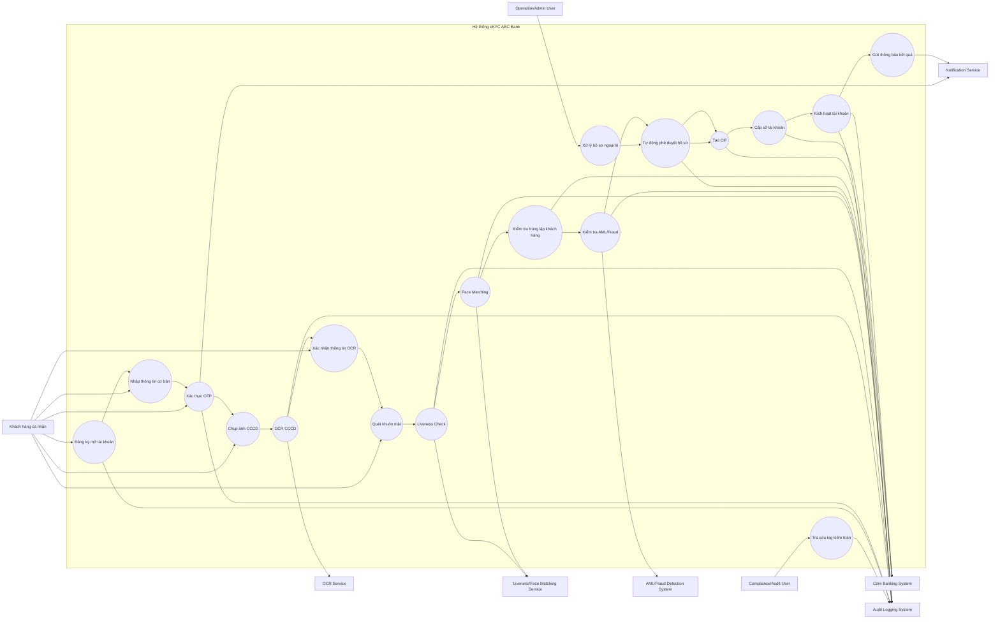

# SOFTWARE REQUIREMENTS SPECIFICATION (SRS)
## Hệ thống mở tài khoản ngân hàng trực tuyến eKYC – ABC Bank

---

## Thông tin tài liệu

| Thuộc tính | Nội dung |
|---|---|
| Tên tài liệu | Software Requirements Specification – Hệ thống eKYC ABC Bank |
| Phiên bản | 1.0 |
| Đối tượng sử dụng | Ban Giám đốc, BA, Development Team, QA Team, Operation, Compliance |
| Mục đích | Handover yêu cầu nghiệp vụ/chức năng/phi chức năng cho đội Development và QA |
| Trạng thái | Draft for handover |

---

# PHẦN 1: INTRODUCTION – GIỚI THIỆU CHUNG

## 1.1. Purpose – Mục đích tài liệu

Tài liệu SRS này mô tả chi tiết các yêu cầu phần mềm cho hệ thống mở tài khoản ngân hàng trực tuyến bằng eKYC của ABC Bank.

Mục đích của tài liệu là:

- Làm căn cứ chính thức để bàn giao yêu cầu cho đội ngũ Development.
- Làm cơ sở để đội QA xây dựng test case, test scenario và kế hoạch kiểm thử.
- Giúp các bên liên quan thống nhất phạm vi, luồng nghiệp vụ, yêu cầu chức năng và phi chức năng.
- Hạn chế hiểu sai yêu cầu trong quá trình phát triển hệ thống.
- Hỗ trợ mục tiêu chiến lược của ngân hàng: **Zero manual operation** – tự động hóa tối đa quy trình mở tài khoản, giảm thiểu sự can thiệp thủ công của giao dịch viên.

---

## 1.2. Scope – Phạm vi hệ thống eKYC

Hệ thống eKYC của ABC Bank cho phép khách hàng cá nhân mở tài khoản ngân hàng trực tuyến thông qua ứng dụng mobile banking.

Phạm vi chính của hệ thống bao gồm:

- Đăng ký thông tin cơ bản của khách hàng.
- Xác thực số điện thoại bằng OTP.
- Chụp ảnh hai mặt CCCD.
- Tự động đọc thông tin CCCD bằng OCR.
- Kiểm tra chất lượng ảnh giấy tờ.
- Xác thực khuôn mặt bằng Liveness Check.
- So khớp khuôn mặt khách hàng với ảnh trên CCCD.
- Kiểm tra trùng lặp khách hàng.
- Kiểm tra rủi ro AML/Fraud.
- Tự động tạo CIF và số tài khoản trên Core Banking.
- Gửi thông báo kết quả mở tài khoản cho khách hàng.
- Ghi log phục vụ kiểm toán và tra soát.

Ngoài phạm vi của tài liệu:

- Phát hành thẻ vật lý.
- Đăng ký khoản vay.
- Định danh doanh nghiệp.
- Quản lý tài khoản sau khi mở.
- Xử lý nghiệp vụ tại quầy giao dịch.
- Tích hợp sâu với hệ sinh thái thanh toán bên thứ ba sau khi tài khoản được kích hoạt.

---

## 1.3. Definitions, Acronyms – Thuật ngữ và từ viết tắt

| Thuật ngữ | Giải thích |
|---|---|
| eKYC | Electronic Know Your Customer – quy trình định danh khách hàng điện tử. |
| KYC | Know Your Customer – quy trình nhận biết và xác minh danh tính khách hàng. |
| CCCD | Căn cước công dân, giấy tờ tùy thân dùng để xác minh danh tính. |
| OCR | Optical Character Recognition – công nghệ nhận dạng ký tự từ hình ảnh. |
| Liveness Check | Kiểm tra người thật, nhằm xác định khách hàng đang thao tác trực tiếp chứ không dùng ảnh/video giả mạo. |
| Face Matching | So khớp khuôn mặt khách hàng với ảnh trên giấy tờ tùy thân. |
| CIF | Customer Information File – mã hồ sơ khách hàng trên hệ thống ngân hàng lõi. |
| Core Banking | Hệ thống ngân hàng lõi dùng để quản lý khách hàng, tài khoản và giao dịch. |
| AML | Anti-Money Laundering – phòng chống rửa tiền. |
| Fraud Detection | Phát hiện gian lận. |
| OTP | One-Time Password – mã xác thực một lần. |
| API | Application Programming Interface – giao diện lập trình ứng dụng. |
| SLA | Service Level Agreement – cam kết chất lượng dịch vụ. |
| PII | Personally Identifiable Information – dữ liệu định danh cá nhân. |
| Zero Manual Operation | Mục tiêu tự động hóa tối đa, hạn chế can thiệp thủ công từ nhân viên ngân hàng. |

---

# PHẦN 2: OVERALL DESCRIPTION – MÔ TẢ TỔNG QUAN

## 2.1. Product Perspective – Góc nhìn sản phẩm

Hệ thống eKYC là một module thuộc hệ sinh thái ngân hàng số ABC Bank. Module này hoạt động trên ứng dụng mobile banking và kết nối với các hệ thống nội bộ, bao gồm:

- Mobile Banking App.
- eKYC Backend.
- OCR Service.
- Liveness Detection Service.
- Face Matching Service.
- AML/Fraud Detection System.
- Core Banking System.
- Notification Service.
- Audit Logging System.
- Admin Portal cho xử lý ngoại lệ.

Về mặt nghiệp vụ, hệ thống đóng vai trò thay thế quy trình mở tài khoản tại quầy bằng một quy trình số hóa hoàn toàn. Khách hàng có thể hoàn thành đăng ký mọi lúc, mọi nơi nếu đáp ứng điều kiện định danh.

---

## 2.2. User Classes and Characteristics – Nhóm người dùng và đặc điểm

| Nhóm người dùng | Đặc điểm | Nhu cầu chính |
|---|---|---|
| Khách hàng cá nhân | Người dùng phổ thông, có điện thoại thông minh, muốn mở tài khoản nhanh chóng. | Đăng ký dễ hiểu, thao tác đơn giản, nhận tài khoản nhanh. |
| Khách hàng ít kinh nghiệm công nghệ | Có thể gặp khó khăn khi chụp CCCD hoặc quét khuôn mặt. | Cần hướng dẫn rõ ràng, thông báo lỗi dễ hiểu. |
| Operation/Admin User | Nhân sự vận hành ngân hàng, chỉ xử lý hồ sơ ngoại lệ. | Xem hồ sơ pending, kiểm tra lý do lỗi, ra quyết định thủ công khi cần. |
| Compliance/Audit User | Nhân sự kiểm soát tuân thủ, kiểm toán nội bộ. | Truy xuất log, kiểm tra lịch sử xử lý hồ sơ, kiểm tra quyết định hệ thống. |
| Development Team | Đội phát triển phần mềm. | Hiểu rõ module, API, rule xử lý và trạng thái hồ sơ. |
| QA Team | Đội kiểm thử. | Xây dựng test case theo từng yêu cầu chức năng và phi chức năng. |

---

## 2.3. Constraints – Các giới hạn về luật pháp và công nghệ

### 2.3.1. Giới hạn pháp lý

- Hệ thống phải tuân thủ quy định về mở và sử dụng tài khoản thanh toán tại tổ chức cung ứng dịch vụ thanh toán theo **Thông tư 17/2024/TT-NHNN**, ban hành ngày 28/06/2024 và có hiệu lực từ ngày 01/07/2024.
- Hệ thống xử lý dữ liệu cá nhân như ảnh CCCD, số CCCD, số điện thoại, ảnh khuôn mặt và dữ liệu sinh trắc học nên phải tuân thủ quy định về bảo vệ dữ liệu cá nhân theo **Nghị định 13/2023/NĐ-CP**, ban hành ngày 17/04/2023 và có hiệu lực từ ngày 01/07/2023.
- Khách hàng phải đồng ý điều khoản sử dụng và chính sách xử lý dữ liệu cá nhân trước khi thực hiện chụp CCCD và quét khuôn mặt.
- Hệ thống phải lưu vết xử lý hồ sơ để phục vụ kiểm toán, tra soát và yêu cầu từ cơ quan quản lý.
- Các trường hợp có dấu hiệu gian lận, rửa tiền hoặc thông tin không hợp lệ không được tự động cấp tài khoản.

### 2.3.2. Giới hạn công nghệ

- Khách hàng phải sử dụng thiết bị có camera trước và sau.
- Ứng dụng cần kết nối Internet ổn định trong quá trình eKYC.
- Chất lượng OCR phụ thuộc vào ảnh CCCD đầu vào.
- Chất lượng Face Matching phụ thuộc vào ánh sáng, góc mặt, chất lượng camera và độ rõ của ảnh trên CCCD.
- Hệ thống phụ thuộc vào độ sẵn sàng của các dịch vụ tích hợp như OCR, Liveness, Face Matching, AML/Fraud và Core Banking.
- Trong trường hợp Core Banking không phản hồi, hồ sơ phải được lưu ở trạng thái Pending và retry tự động.

---

# PHẦN 3: SPECIFIC FUNCTIONAL REQUIREMENTS – YÊU CẦU CHỨC NĂNG CHI TIẾT

## 3.1. Module 1: Đăng ký tài khoản

### FR-REG-01: Khởi tạo quy trình mở tài khoản

| Thuộc tính | Nội dung |
|---|---|
| Mô tả | Hệ thống cho phép khách hàng bắt đầu quy trình mở tài khoản trực tuyến trên mobile app. |
| Actor | Khách hàng cá nhân |
| Input | Người dùng chọn “Mở tài khoản trực tuyến”. |
| Output | Màn hình đăng ký thông tin được hiển thị. |
| Priority | High |

### FR-REG-02: Nhập thông tin cơ bản

| Thuộc tính | Nội dung |
|---|---|
| Mô tả | Hệ thống cho phép khách hàng nhập họ tên, ngày sinh, số điện thoại, email và mã giới thiệu nếu có. |
| Actor | Khách hàng cá nhân |
| Input | Thông tin cá nhân cơ bản. |
| Output | Hồ sơ đăng ký tạm thời được tạo. |
| Priority | High |

### FR-REG-03: Đồng ý điều khoản sử dụng

| Thuộc tính | Nội dung |
|---|---|
| Mô tả | Khách hàng phải xác nhận đồng ý với điều khoản sử dụng, chính sách bảo mật và xử lý dữ liệu cá nhân. |
| Actor | Khách hàng cá nhân |
| Input | Checkbox đồng ý điều khoản. |
| Output | Hệ thống cho phép tiếp tục quy trình. |
| Priority | High |
| Business Rule | Nếu khách hàng chưa đồng ý điều khoản, hệ thống không cho phép tiếp tục. |

### FR-REG-04: Xác thực số điện thoại bằng OTP

| Thuộc tính | Nội dung |
|---|---|
| Mô tả | Hệ thống gửi OTP đến số điện thoại khách hàng và xác thực OTP do khách hàng nhập. |
| Actor | Khách hàng cá nhân, Notification Service |
| Input | Số điện thoại, mã OTP. |
| Output | Số điện thoại được xác thực thành công hoặc thất bại. |
| Priority | High |
| Business Rule | OTP có thời hạn hiệu lực. Nếu nhập sai quá số lần cho phép, hệ thống tạm khóa chức năng gửi OTP. |

---

## 3.2. Module 2: Upload & Đọc CCCD bằng OCR

### FR-OCR-01: Chụp ảnh mặt trước CCCD

| Thuộc tính | Nội dung |
|---|---|
| Mô tả | Hệ thống cho phép khách hàng chụp ảnh mặt trước CCCD bằng camera điện thoại. |
| Actor | Khách hàng cá nhân |
| Input | Ảnh mặt trước CCCD. |
| Output | Ảnh được gửi lên hệ thống eKYC. |
| Priority | High |

### FR-OCR-02: Chụp ảnh mặt sau CCCD

| Thuộc tính | Nội dung |
|---|---|
| Mô tả | Hệ thống cho phép khách hàng chụp ảnh mặt sau CCCD. |
| Actor | Khách hàng cá nhân |
| Input | Ảnh mặt sau CCCD. |
| Output | Ảnh được gửi lên hệ thống eKYC. |
| Priority | High |

### FR-OCR-03: Kiểm tra chất lượng ảnh CCCD

| Thuộc tính | Nội dung |
|---|---|
| Mô tả | Hệ thống tự động kiểm tra ảnh CCCD có đủ điều kiện xử lý hay không. |
| Điều kiện kiểm tra | Đủ bốn góc, không mờ, không lóa, không bị che khuất, đúng loại giấy tờ. |
| Output | Ảnh đạt hoặc không đạt. |
| Priority | High |
| Exception | Nếu ảnh không đạt, hệ thống hiển thị lý do và yêu cầu chụp lại. |

### FR-OCR-04: Trích xuất thông tin CCCD bằng OCR

| Thuộc tính | Nội dung |
|---|---|
| Mô tả | Hệ thống sử dụng OCR để đọc thông tin từ ảnh CCCD. |
| Input | Ảnh mặt trước và mặt sau CCCD hợp lệ. |
| Output | Số CCCD, họ tên, ngày sinh, giới tính, quốc tịch, quê quán, nơi thường trú, ngày cấp. |
| Priority | High |

### FR-OCR-05: Hiển thị thông tin OCR cho khách hàng xác nhận

| Thuộc tính | Nội dung |
|---|---|
| Mô tả | Hệ thống hiển thị thông tin đã trích xuất để khách hàng kiểm tra và xác nhận. |
| Actor | Khách hàng cá nhân |
| Input | Dữ liệu OCR. |
| Output | Khách hàng xác nhận thông tin hoặc yêu cầu chụp lại. |
| Priority | Medium |

### FR-OCR-06: Đối chiếu thông tin khách hàng nhập với dữ liệu OCR

| Thuộc tính | Nội dung |
|---|---|
| Mô tả | Hệ thống đối chiếu thông tin khách hàng nhập ban đầu với thông tin trích xuất từ CCCD. |
| Input | Thông tin đăng ký, dữ liệu OCR. |
| Output | Kết quả trùng khớp hoặc không trùng khớp. |
| Priority | High |
| Business Rule | Nếu thông tin sai lệch vượt ngưỡng cho phép, hồ sơ bị từ chối hoặc chuyển sang xử lý ngoại lệ. |

---

## 3.3. Module 3: Xác thực khuôn mặt

### FR-FACE-01: Quét khuôn mặt khách hàng

| Thuộc tính | Nội dung |
|---|---|
| Mô tả | Hệ thống cho phép khách hàng quét khuôn mặt qua camera trước của thiết bị. |
| Actor | Khách hàng cá nhân |
| Input | Video hoặc chuỗi ảnh khuôn mặt. |
| Output | Dữ liệu khuôn mặt được gửi đến hệ thống xác thực. |
| Priority | High |

### FR-FACE-02: Hướng dẫn thao tác Liveness

| Thuộc tính | Nội dung |
|---|---|
| Mô tả | Hệ thống hiển thị hướng dẫn như nhìn thẳng, quay trái/phải, chớp mắt hoặc đọc số ngẫu nhiên. |
| Actor | Mobile App |
| Output | Người dùng thực hiện thao tác đúng yêu cầu. |
| Priority | Medium |

### FR-FACE-03: Kiểm tra Liveness

| Thuộc tính | Nội dung |
|---|---|
| Mô tả | Hệ thống kiểm tra khách hàng có phải người thật đang thao tác trực tiếp hay không. |
| Input | Dữ liệu khuôn mặt theo thời gian thực. |
| Output | Kết quả Pass/Fail. |
| Priority | High |
| Exception | Nếu phát hiện ảnh, video, mặt nạ hoặc deepfake, hệ thống từ chối hồ sơ hoặc yêu cầu thử lại. |

### FR-FACE-04: So khớp khuôn mặt với ảnh CCCD

| Thuộc tính | Nội dung |
|---|---|
| Mô tả | Hệ thống so sánh khuôn mặt khách hàng với ảnh chân dung trên CCCD. |
| Input | Ảnh khuôn mặt live, ảnh trên CCCD. |
| Output | Điểm matching. |
| Priority | High |
| Business Rule | Điểm matching phải đạt ngưỡng do ngân hàng cấu hình. |

### FR-FACE-05: Giới hạn số lần thử xác thực khuôn mặt

| Thuộc tính | Nội dung |
|---|---|
| Mô tả | Hệ thống giới hạn số lần khách hàng được thực hiện lại Liveness/Face Matching. |
| Actor | eKYC System |
| Output | Cho phép thử lại, khóa tạm thời hoặc chuyển xử lý ngoại lệ. |
| Priority | High |

---

## 3.4. Module 4: Kiểm tra rủi ro và kích hoạt tài khoản

### FR-ACT-01: Kiểm tra khách hàng đã tồn tại

| Thuộc tính | Nội dung |
|---|---|
| Mô tả | Hệ thống kiểm tra khách hàng đã có CIF hoặc tài khoản tại ABC Bank hay chưa. |
| Input | Số CCCD, số điện thoại, email. |
| Output | Khách hàng mới hoặc khách hàng hiện hữu. |
| Priority | High |
| Business Rule | Không tạo CIF mới nếu khách hàng đã tồn tại. |

### FR-ACT-02: Kiểm tra AML/Fraud

| Thuộc tính | Nội dung |
|---|---|
| Mô tả | Hệ thống kiểm tra khách hàng với danh sách rủi ro, danh sách đen, dấu hiệu gian lận hoặc phòng chống rửa tiền. |
| Input | Thông tin định danh khách hàng. |
| Output | Risk Score hoặc trạng thái Pass/Review/Reject. |
| Priority | High |

### FR-ACT-03: Tự động phê duyệt hồ sơ

| Thuộc tính | Nội dung |
|---|---|
| Mô tả | Hệ thống tự động phê duyệt hồ sơ nếu tất cả bước xác thực đạt yêu cầu. |
| Input | Kết quả OCR, Liveness, Face Matching, AML/Fraud, kiểm tra trùng lặp. |
| Output | Hồ sơ được phê duyệt tự động. |
| Priority | High |

### FR-ACT-04: Tự động từ chối hồ sơ

| Thuộc tính | Nội dung |
|---|---|
| Mô tả | Hệ thống tự động từ chối hồ sơ nếu vi phạm điều kiện nghiệp vụ rõ ràng. |
| Input | Kết quả kiểm tra không đạt. |
| Output | Hồ sơ bị từ chối và khách hàng nhận thông báo phù hợp. |
| Priority | High |
| Business Rule | Không hiển thị chi tiết nhạy cảm có thể bị lợi dụng để gian lận. |

### FR-ACT-05: Tạo CIF trên Core Banking

| Thuộc tính | Nội dung |
|---|---|
| Mô tả | Hệ thống gửi thông tin khách hàng hợp lệ sang Core Banking để tạo CIF. |
| Input | Hồ sơ khách hàng đã duyệt. |
| Output | Mã CIF được tạo. |
| Priority | High |

### FR-ACT-06: Cấp số tài khoản tự động

| Thuộc tính | Nội dung |
|---|---|
| Mô tả | Sau khi tạo CIF, Core Banking cấp số tài khoản thanh toán cho khách hàng. |
| Input | Mã CIF, thông tin sản phẩm tài khoản. |
| Output | Số tài khoản ngân hàng. |
| Priority | High |

### FR-ACT-07: Kích hoạt tài khoản

| Thuộc tính | Nội dung |
|---|---|
| Mô tả | Hệ thống kích hoạt tài khoản ở trạng thái phù hợp sau khi cấp số tài khoản thành công. |
| Input | Số tài khoản đã tạo. |
| Output | Tài khoản được kích hoạt. |
| Priority | High |

### FR-ACT-08: Gửi thông báo kết quả

| Thuộc tính | Nội dung |
|---|---|
| Mô tả | Hệ thống gửi thông báo kết quả mở tài khoản cho khách hàng qua app, SMS hoặc email. |
| Input | Trạng thái hồ sơ. |
| Output | Thông báo thành công, từ chối hoặc pending. |
| Priority | Medium |

### FR-ACT-09: Lưu log và lịch sử xử lý

| Thuộc tính | Nội dung |
|---|---|
| Mô tả | Hệ thống lưu lại toàn bộ lịch sử thao tác và quyết định xử lý hồ sơ. |
| Actor | eKYC System, Audit Logging System |
| Output | Log phục vụ kiểm toán, tra soát, điều tra gian lận. |
| Priority | High |

---

# PHẦN 4: NON-FUNCTIONAL REQUIREMENTS – YÊU CẦU PHI CHỨC NĂNG

## 4.1. Security – Bảo mật dữ liệu cá nhân

| Mã yêu cầu | Nội dung |
|---|---|
| NFR-SEC-01 | Toàn bộ dữ liệu truyền giữa mobile app và backend phải sử dụng HTTPS/TLS. |
| NFR-SEC-02 | Dữ liệu nhạy cảm như CCCD, ảnh khuôn mặt, số điện thoại, email phải được mã hóa khi lưu trữ. |
| NFR-SEC-03 | Hệ thống phải phân quyền truy cập dữ liệu theo vai trò người dùng. |
| NFR-SEC-04 | Admin chỉ được truy cập hồ sơ ngoại lệ theo quyền được cấp. |
| NFR-SEC-05 | Hệ thống phải ghi log mọi hành động truy cập, xem, sửa, phê duyệt hoặc từ chối hồ sơ. |
| NFR-SEC-06 | Token phiên làm việc phải có thời hạn và được bảo vệ chống đánh cắp. |
| NFR-SEC-07 | Hệ thống phải có cơ chế chống replay attack, bot, giả mạo thiết bị và brute-force OTP. |
| NFR-SEC-08 | Dữ liệu cá nhân chỉ được xử lý sau khi khách hàng đồng ý với chính sách bảo mật và xử lý dữ liệu. |
| NFR-SEC-09 | Hệ thống không được trả về thông báo lỗi quá chi tiết đối với các trường hợp nghi ngờ gian lận. |

---

## 4.2. Performance – Hiệu năng và thời gian phản hồi API

| Mã yêu cầu | Nội dung |
|---|---|
| NFR-PER-01 | API gửi OTP phản hồi trong tối đa 3 giây trong điều kiện bình thường. |
| NFR-PER-02 | API xác thực OTP phản hồi trong tối đa 2 giây. |
| NFR-PER-03 | API upload ảnh CCCD phản hồi trong tối đa 5 giây với ảnh đạt dung lượng quy định. |
| NFR-PER-04 | OCR CCCD hoàn tất trong tối đa 5 giây trong điều kiện bình thường. |
| NFR-PER-05 | Liveness Check hoàn tất trong tối đa 10 giây. |
| NFR-PER-06 | Face Matching hoàn tất trong tối đa 5 giây. |
| NFR-PER-07 | Kiểm tra AML/Fraud hoàn tất trong tối đa 5 giây nếu dịch vụ tích hợp hoạt động bình thường. |
| NFR-PER-08 | Tạo CIF và số tài khoản trên Core Banking hoàn tất trong tối đa 10 giây. |
| NFR-PER-09 | Toàn bộ quy trình eKYC nên hoàn tất trong vòng 3–5 phút nếu khách hàng cung cấp dữ liệu hợp lệ. |
| NFR-PER-10 | Hệ thống phải hỗ trợ xử lý đồng thời nhiều hồ sơ eKYC trong các đợt cao điểm marketing. |

---

## 4.3. Availability – Tính sẵn sàng của hệ thống

| Mã yêu cầu | Nội dung |
|---|---|
| NFR-AVL-01 | Hệ thống eKYC phải đạt mức sẵn sàng tối thiểu 99,5% mỗi tháng. |
| NFR-AVL-02 | Các dịch vụ quan trọng như OTP, OCR, Liveness, Face Matching và Core Banking phải có cơ chế retry khi lỗi tạm thời. |
| NFR-AVL-03 | Khi dịch vụ bên thứ ba không phản hồi, hồ sơ phải được lưu ở trạng thái Pending thay vì mất dữ liệu. |
| NFR-AVL-04 | Hệ thống phải có cơ chế cảnh báo khi tỷ lệ lỗi API vượt ngưỡng cấu hình. |
| NFR-AVL-05 | Hệ thống phải có cơ chế backup dữ liệu định kỳ. |
| NFR-AVL-06 | Hệ thống phải hỗ trợ khôi phục sau sự cố trong thời gian phù hợp với SLA nội bộ của ngân hàng. |

---

## 4.4. Usability – Trải nghiệm người dùng

| Mã yêu cầu | Nội dung |
|---|---|
| NFR-UX-01 | Giao diện eKYC phải đơn giản, dễ hiểu, phù hợp với người dùng phổ thông. |
| NFR-UX-02 | Hệ thống phải hướng dẫn rõ cách chụp CCCD và quét khuôn mặt. |
| NFR-UX-03 | Thông báo lỗi phải cụ thể, ví dụ: ảnh bị mờ, ảnh bị lóa, thiếu góc CCCD, khuôn mặt quá tối. |
| NFR-UX-04 | Người dùng không phải nhập lại toàn bộ dữ liệu nếu lỗi xảy ra ở bước sau. |
| NFR-UX-05 | Quy trình không nên có quá nhiều bước gây rời bỏ đăng ký. |

---

## 4.5. Auditability – Khả năng kiểm toán

| Mã yêu cầu | Nội dung |
|---|---|
| NFR-AUD-01 | Mỗi hồ sơ eKYC phải có mã định danh duy nhất. |
| NFR-AUD-02 | Hệ thống phải lưu thời gian thực hiện từng bước: đăng ký, OTP, OCR, Liveness, Face Matching, AML/Fraud, tạo tài khoản. |
| NFR-AUD-03 | Hệ thống phải lưu kết quả xử lý và lý do phê duyệt/từ chối/pending. |
| NFR-AUD-04 | Log phải có khả năng truy xuất theo số CCCD, số điện thoại, mã hồ sơ hoặc CIF. |
| NFR-AUD-05 | Người dùng nội bộ xem log phải được phân quyền và ghi nhận lịch sử truy cập. |

---

# PHẦN 5: VISUAL DIAGRAM – SƠ ĐỒ TRỰC QUAN

## 5.1. Use Case Diagram bằng Mermaid

---

# 6. KẾT LUẬN

Tài liệu SRS này mô tả đầy đủ phạm vi, người dùng, ràng buộc, yêu cầu chức năng, yêu cầu phi chức năng và sơ đồ Use Case cho hệ thống mở tài khoản trực tuyến eKYC của ABC Bank.

Các yêu cầu trọng tâm của hệ thống gồm:

- Tự động hóa quy trình mở tài khoản.
- Xác thực danh tính khách hàng bằng CCCD và khuôn mặt.
- Tích hợp Core Banking để tạo CIF và số tài khoản.
- Kiểm soát rủi ro thông qua AML/Fraud.
- Bảo vệ dữ liệu cá nhân và dữ liệu sinh trắc học.
- Đảm bảo hiệu năng, tính sẵn sàng và khả năng kiểm toán.

Tài liệu này có thể được sử dụng làm cơ sở để đội Development thiết kế hệ thống, đội QA xây dựng test case và đội quản lý dự án kiểm soát phạm vi triển khai.
